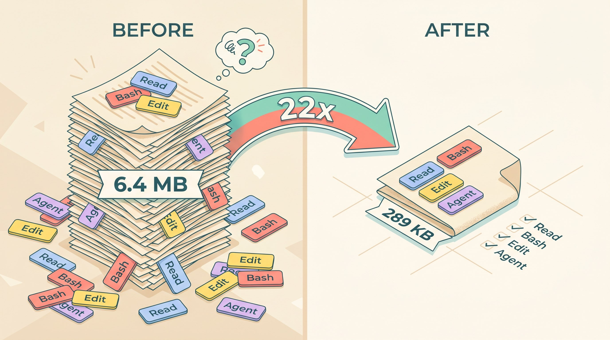

<div align="center">


# compact-manual

**A deterministic `/compact` for Claude Code — no LLM, no paraphrase, no lost context.**


</div>

I kept running out of context in Claude Code debugging sessions. So I wrote a deterministic `/compact` alternative in ~600 lines of stdlib Python — no LLM, no paraphrase, no silent loss. It reads the raw JSONL and trims only the noisy parts.

---

## The problem

Claude Code's built-in `/compact` hands your session to an LLM and asks it to summarize. The model decides what matters. You can't audit that decision, and you're paying tokens for the model to compress its own work.

The failure mode is specific: the exact path, stack trace, or variable value you needed ten turns later gets flattened into prose. Fluent, opaque, and wrong in ways you only notice once the information is gone.

## The idea

Don't summarize. Trim.

**85% of a typical session's weight is `tool_results`** — `ls` dumps, file reads, 20,000-line build logs. The dialogue is ~10%. So: keep every user prompt and assistant message verbatim; truncate only the tool outputs, with explicit markers where bytes were dropped. The compression becomes a set of rules you can read, not a model's judgment.

## Our solution: `compact-manual`

|  | `compact-manual` | native `/compact` |
|---|---|---|
| Engine | Deterministic rules | LLM summarization |
| Dialogue | Verbatim | Paraphrased |
| Cost | Free, local | Input + output tokens |
| Speed | <200ms on 60MB | API-bound |
| Auditable | Yes (markers + open code) | No (opaque) |
| Ratio | 4–10% (predictable) | Variable |

Measured on a real 6.4 MB debugging session: **compressed to 289 KB (4.5% ratio, 22× smaller)**, with 100% of user prompts and assistant text preserved verbatim.

## What you'll see when you run it

```
/compact-manual (conservative)   <session-uuid>.jsonl
─────────────────────────────────────────────────────────────
Original:     2,545,834 bytes  (~848,611 tokens)
Compressed:     273,927 chars  (~ 91,309 tokens)
Ratio:             10.8%        →   saved ~757,302 tokens
Turns:              77   (user 20 / assistant 57)
Tools:       Agent×86, Edit×39, Bash×33, Read×8…

✓ Copied to clipboard (273,927 chars)

Next step — fresh session with the transcript as sole context:
  1.  /clear       ← new session (clean JSONL)
  2.  Cmd+V        ← paste transcript
  3.  Enter        ← send
```

---

## Install

```bash
git clone https://github.com/mario-hernandez/claude-compact-manual.git
cd claude-compact-manual
mkdir -p ~/.claude/skills/compact-manual/scripts
cp SKILL.md ~/.claude/skills/compact-manual/
cp scripts/compact.py ~/.claude/skills/compact-manual/scripts/
chmod +x ~/.claude/skills/compact-manual/scripts/compact.py
```

Restart Claude Code if it was open. In any long session:

```
/compact-manual   → compresses to clipboard
/clear            → fresh session (NOT ESC ESC — that's file rewind)
Cmd+V + Enter     → continue with the compressed context
```

That's the whole workflow.

<div align="center">


*The 4-step workflow*

</div>

---

## FAQ

**Why not just use an LLM to summarize?**
Because losing code is worse than saving tokens. Summarization is lossy by construction and the loss is silent. A 90% context for a 100% faithful digest beats 95% context for a plausible-sounding fiction. If you disagree, the built-in `/compact` is still there — use it.

**Why macOS only?**
It shells out to `pbcopy`/`pbpaste`. PRs with `xclip`/`clip.exe` support welcome.

**Why no formal tests?**
~600 LOC of straightforward stdlib. Before release, 9 parallel agents across 2 rounds did adversarial review and fixed ~20 bugs. A tool for auditing LLM output, audited by pools of LLM agents. Turtles all the way down. A PR adding pytest coverage would be welcome.

**Will it break when Anthropic changes the JSONL schema?**
Yes. That's the deal — the schema is undocumented and not a public API. If you depend on this in a production pipeline, don't.

**Are secrets redacted?**
No — deliberately. Secrets in a session are often legitimate context ("use this API key for this test"). If that worries you, delete `~/.claude/compact-backups/` after use.

## Limitations, stated upfront

- **macOS only.** `pbcopy`/`pbpaste`.
- **Schema-fragile.** Breaks silently if JSONL format shifts. You'll notice ratios going weird.
- **Prose-heavy sessions compress poorly** (~15–20%) — fewer tool_results to trim.

---

## Dive deeper

The README is the story. The docs are the manual.

- [**docs/install.md**](docs/install.md) — requirements, step-by-step, first-run walkthrough, when to compact
- [**docs/usage.md**](docs/usage.md) — the 5 modes, every flag, real examples, backup recovery
- [**docs/philosophy.md**](docs/philosophy.md) — why deterministic beats LLM-summarized (side-by-side, when native `/compact` still wins)
- [**docs/benchmarks.md**](docs/benchmarks.md) — real measurements across 7 sessions, perf curves, tokenization notes
- [**docs/architecture.md**](docs/architecture.md) — repo layout, pipeline diagram, key functions, design decisions
- [**docs/internals.md**](docs/internals.md) — algorithm, edge cases, dedup internals, error-preservation regex
- [**docs/faq.md**](docs/faq.md) — extended FAQ, troubleshooting, roadmap

[**SKILL.md**](SKILL.md) · [**CHANGELOG.md**](CHANGELOG.md) · [**CONTRIBUTING.md**](CONTRIBUTING.md) · [**SECURITY.md**](SECURITY.md) · [**LICENSE**](LICENSE)

<div align="center">



*Real measurement: 6.4 MB session compressed to 289 KB (4.5% ratio, 22× smaller)*

</div>

---

MIT License. macOS + Claude Code v2.x. Personal tool made public — "works on my Mac" software. Built with Claude Code, iterated with parallel agent pools.

If it helped you, a star is the clearest signal the tool is worth keeping alive. [Issues](https://github.com/mario-hernandez/claude-compact-manual/issues) and PRs welcome — especially a weird JSONL that breaks it, a ratio that surprised you, or a flag you wish existed.
