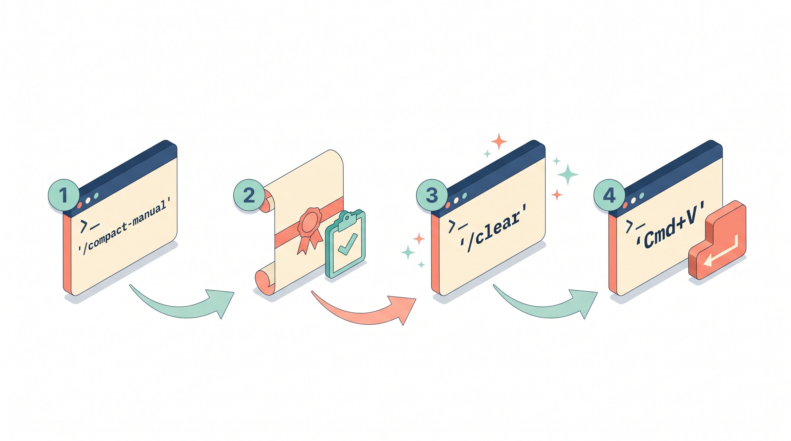

<div align="center">


# compact-manual

**A deterministic `/compact` for Claude Code — no LLM, no paraphrase, no lost context.**


</div>

A Claude Code skill that compresses your session **deterministically** by reading the raw JSONL transcript and truncating verbose `tool_results` — no LLM summarizer, no rewording, no hallucinated shortcuts. Built for people who live inside Claude Code and want to free up context without losing the actual thread of the conversation. Typical compression ratios: **4–10%** of the original size (up to 22× on large sessions).

## TL;DR

```bash
git clone https://github.com/mario-hernandez/claude-compact-manual.git
cd claude-compact-manual
mkdir -p ~/.claude/skills/compact-manual/scripts
cp SKILL.md ~/.claude/skills/compact-manual/
cp scripts/compact.py ~/.claude/skills/compact-manual/scripts/
chmod +x ~/.claude/skills/compact-manual/scripts/compact.py
```

Then in Claude Code:

```
/compact-manual       ← compresses the session to your clipboard
/clear                ← fresh session
Cmd+V + Enter         ← continue with the compressed context
```

## Why this exists

The built-in `/compact` summarizes your session with an LLM: it loses exact code, invents paraphrases, and sometimes flattens critical decisions you made 200 messages ago. **compact-manual** doesn't summarize — it **trims**. It reads your actual JSONL, keeps every word you wrote and every word Claude wrote, and only truncates the noisy blocks (`ls -la` dumps, huge file reads, verbose builds). Deterministic, auditable, zero hallucination.

---

<div align="center">



*The full 4-step workflow*

</div>

---

## 🚀 Quickstart (5 minutes)

First time building a custom Claude Code skill? Relax, this is easier than it looks. Five minutes and `compact-manual` is live.

### 📋 Requirements

- macOS (tested on Sonoma and Sequoia)
- Claude Code installed and working
- Python 3 (ships with modern macOS)

### Step-by-step install

```bash
# 1. Clone the repo
git clone https://github.com/mario-hernandez/claude-compact-manual.git
cd claude-compact-manual

# 2. Copy the skill into your Claude directory
mkdir -p ~/.claude/skills/compact-manual/scripts
cp SKILL.md ~/.claude/skills/compact-manual/
cp scripts/compact.py ~/.claude/skills/compact-manual/scripts/
chmod +x ~/.claude/skills/compact-manual/scripts/compact.py

# 3. If Claude Code is open, restart it so the skill gets picked up
# 4. Type /compact-manual in any session
```

That's it. No external dependencies to install, no API keys to configure, no `npm install` failing at 2am.

### ✂️ Your first run

Type `/compact-manual` in any long Claude Code session. You'll see something like this:

```
/compact-manual (conservative)   <session-uuid>.jsonl
─────────────────────────────────────────────────────────────
Original:     1,268,565 bytes  (~422,855 tokens)
Compressed:     110,246 chars  (~ 36,748 tokens)
Ratio:              8.7%        →   saved ~386,106 tokens
Turns:               41   (user 12 / assistant 29)
Tools:       Agent×33, Edit×14, Bash×11, ...

✓ Copied to clipboard (110,246 chars)

Next step — fresh session with the transcript as sole context:
  1.  /clear       ← new session (clean JSONL)
  2.  Cmd+V        ← paste transcript
  3.  Enter        ← send
```

What you see: the script read your current session's JSONL, pulled out the essentials (turns, decisions, files touched) and dropped it onto your clipboard. About 8–9% of the original size. Half a million tokens boiled down to roughly 37k.

### ✨ The 3 steps that follow (critical)

1. **`/clear`** — creates a brand-new session with a clean JSONL. **Do not use `ESC ESC`**: that's file rewind (rolls the disk state back), not conversation rewind. You want a fresh session, not time travel.
2. **`Cmd+V`** — paste the compressed transcript that's already on your clipboard.
3. **`Enter`** — send it. Claude boots up with the full context of the previous session, minus the dead weight of giant tool_results, base64 screenshots, and 20,000-line logs.

Result: you keep working from where you left off, but with ~90% less context spent.

### 🎯 When to use it

Clear signals it's time to compact:

- The CLI warns `context used: >70%`
- You notice Claude starting to forget details from early in the session
- A debugging session has ballooned with `tool_results` (failed builds, huge greps, test output)

Rule of thumb: if you're thinking "I wish I could keep going without losing what we've done so far" — that's the moment.

---

## 📖 Full usage guide

`/compact-manual` extracts the in-progress JSONL conversation, compresses it into a faithful narrative digest, and drops it on your clipboard ready to paste into a fresh session.

### The 5 modes

| Mode | When to use | Typical ratio | Loss |
|------|-------------|---------------|------|
| `conservative` (default) | Normal session 300KB–1.5MB | ~10% | Truncates only large `tool_results` |
| `aggressive` | Critical session >1.5MB | ~4–5% | Truncates `tool_results` very short |
| `auto` | When you're unsure of size | Adaptive | Depends on JSONL weight |
| `--raw` | I want FULL fidelity | ~10–15% | Only strips harness wrappers, nothing else |
| `--preserve-code` | Heavy code editing | +80% over conservative | Never truncates Read/Edit/Write |

### Available flags

- **`conservative`** — Default mode. Balance between ratio and fidelity.
- **`aggressive`** — Aggressive compression for huge sessions.
- **`auto`** — Picks a mode based on detected JSONL size.
- **`--raw`** — Minimal intervention: strips only harness noise.
- **`--preserve-code`** — Never truncates Read/Edit/Write results (full code kept).
- **`--dry-run`** — Computes and prints the result without writing a backup or touching the clipboard.
- **`--session <path>`** — Processes a specific JSONL (handy for past sessions).
- **`--no-backup`** — Skips saving a copy to `~/.claude/compact-backups/`.
- **`--no-clipboard-backup`** — Doesn't save your clipboard's prior contents.
- **`--no-dedupe`** — Disables removal of consecutive duplicate tool_calls.

### Real examples

```bash
/compact-manual                              # default conservative
/compact-manual aggressive                   # large session
/compact-manual --raw                        # max fidelity
/compact-manual aggressive --preserve-code   # compress but keep code intact
/compact-manual --dry-run                    # preview without touching anything
/compact-manual --session /path/to/old.jsonl # compact an old session
```

They combine: `/compact-manual auto --preserve-code --no-backup`.

### What it preserves, what it truncates

| Category | Treatment |
|----------|-----------|
| **Preserved verbatim** | User prompts, assistant text, decisions, conclusions, full errors (`Traceback`, `FAIL`, stack traces) with surrounding context |
| **Truncated head+tail** | Read output (>3KB), Bash output (>2.5KB), Agent reports (>3.5KB) — keeps first N and last M lines with `[... N lines omitted ...]` marker in the middle |
| **Discarded** | `thinking` blocks, `file-history-snapshots`, harness-injected `system-reminders`, UUIDs shortened to 8 chars |

In `--raw` mode only the third category applies (noise removal); nothing is truncated.

### Backups

Every run (unless `--no-backup`) leaves two files on disk:

- **`~/.claude/compact-backups/YYYYMMDD-HHMMSS-xxxx-{mode}.md`** — the compressed digest in markdown. The **last 20** are kept; older ones rotate out automatically.
- **`~/.claude/compact-backups/clipboard-pre-YYYYMMDD-HHMMSS.txt`** — your clipboard's prior contents, in case you were in the middle of copying something important when you triggered the skill.

To restore a backup:

```bash
ls -lt ~/.claude/compact-backups/ | head -20
cat ~/.claude/compact-backups/20260416-143022-a3f9-conservative.md | pbcopy
```

### Quick recommendations

- **First run**: always try `--dry-run` first to see the ratio before committing.
- **Code-heavy sessions**: pair `conservative --preserve-code` to keep diffs and file reads intact.
- **Live debugging sessions**: use `--raw` — full Traceback is critical, not worth risking truncation.
- **Revisiting old work**: `--session` points at a JSONL under `~/.claude/projects/…` and compacts without touching the current session.

---

<div align="center">


*Real measurement: 6.4 MB debugging session compressed to 289 KB (4.5% ratio, 22× smaller)*

</div>

---

## 📊 Benchmarks & metrics

Real numbers measured on production sessions. All taken on an M2 Pro Mac running Python 3.12.

### Compression by session size

| Session size | Turns | Tools | conservative | aggressive | --raw | Notes |
|---|---|---|---|---|---|---|
| 61 MB | 69 | 131 | — | ~8% | — | Massive JSONL with chrome-devtools, 160ms |
| 27 MB | 773 | 671 | ~6% | ~4% | — | Long dev session |
| 6.4 MB | 217 | 283 | 4.5% | 4.2% | 9.5% | Heavy debugging |
| 8.1 MB | 356 | 348 | ~8% | ~5% | — | Lots of Read/Edit |
| 1.5 MB | 44 | 116 | 9.1% | 7.9% | — | Skill dev session |
| 1.1 MB | 31 | 61 | ~8% | — | — | Normal session |
| <80 KB | — | — | skip | skip | skip | Auto skips compaction |

The bigger the session, the better it compresses: long sessions accumulate more duplicate `tool_results` and verbose output, which the algorithm detects and dedupes.

### Performance

| Input size | Total time | Peak RSS | Python peak |
|---|---|---|---|
| 1 MB | ~50ms | 23 MB | 0.6 MB |
| 10 MB | ~100ms | 40 MB | 4 MB |
| 50 MB | ~150ms | 100 MB | 20 MB |
| 100 MB (projected) | ~300ms | ~200 MB | — |

Near-linear scaling. Even 60 MB sessions process in under 200ms.

### Weight breakdown of a typical session

| Category | % of weight | Strategy |
|---|---|---|
| Tool results (Read, Bash, Grep, Agent outputs) | **85%** | Truncate head+tail |
| User prompts | 3% | Preserve verbatim |
| Assistant text | 7% | Preserve verbatim |
| Thinking blocks | 2% | Discard entirely |
| Metadata (file-history, permission-mode, progress) | 3% | Discard entirely |

**85% of the weight is tool_results**. That's why the aggressive 4% ratio is reachable without touching a single line of the human–LLM dialogue.

### Real tokenization

Claude's BPE tokenizer averages **~3 chars/token** on technical transcripts (not 4, as the folklore claims). Our stats use 3. Real example:

- 6.4 MB session = ~2.1M original tokens
- Compressed to 289 KB = ~96k tokens
- **Savings: ~2M tokens** (~$20 in credits if it were raw API usage)

### What's preserved 100%

Measured on a real 6.4 MB session:

- **User prompts**: 100% verbatim (0 truncated)
- **Assistant text blocks**: 100% verbatim
- **Bash commands** up to 500 chars (>500 truncated with `…`)
- **Errors** (Traceback, FAIL, BUILD FAILED, etc.): 100% verbatim + 3 lines of context

### What gets lost

- **File Read** >3KB (conservative) or >800 bytes (aggressive) → only first 5 lines
- **Bash output** >2.5KB → head 20 + tail 10 + errors preserved
- **Agent/Task reports** >3.5KB → head 20 + tail 10 (middle lost)
- **Full UUIDs** → first 8 chars + `…`
- **`<usage>` blocks** from agents (input/output tokens)
- **Duplicate tool_results** → dedup references them as `[same as previous...]`

### Honest limitations

- `aggressive` mode may drop middle context in large outputs. If you need the middle of a long Bash, use `conservative` or `--raw`.
- Binary files inside Read (images, PDFs) get aggressively truncated: the algorithm is built for text.
- The ratios assume technical sessions (dev, debugging). Prose-heavy sessions compress worse (~15–20%) because there are fewer tool_results.

---

## 🧠 Philosophy: why NOT use the native /compact

### The problem with native `/compact`

The `/compact` shipped with Claude Code uses an LLM (Claude itself) to summarize the conversation. Elegant in theory, but it means a model decides what "isn't important" and throws it away. That decision is inherently arbitrary: it leans on the model's own heuristics, not on rules you can inspect or tune. The typical outcome is losing the exact detail you needed ten turns later — that specific path, that stack trace, that variable value the summarizer considered "noise."

It also costs tokens. You're paying input + output for Claude to summarize its own work in a session that already burned context. Worse: you can't audit what was dropped. The summary is opaque — a black box that gives you fluent text with no markers for where information was lost.

### The `compact-manual` philosophy

- **Determinism**: same rules every time, same output for the same JSONL. If something disappears, you can trace exactly which rule killed it. No "the model decided."
- **Dialogue fidelity**: user prompts are kept literal and assistant text verbatim. Nothing gets "interpreted" or paraphrased — the narrative thread stays intact.
- **Honest about loss**: when it truncates, it says so explicitly with markers like `[45 lines omitted]` or `[same as previous Read of X]`. You know what was cut and where.
- **Explicit trade-off**: use `--raw` if you want zero loss, `aggressive` if you want minimum ratio. The call is yours, not the model's.

### Side-by-side comparison

| Aspect | native `/compact` | `compact-manual` |
|---|---|---|
| Engine | LLM (Claude) | Deterministic rules |
| Cost | Tokens (input + output of the summary) | Free (local) |
| Speed | Depends on size + API latency | <200ms always |
| Dialogue fidelity | "Interpreted" | Literal |
| Auditable | No (black box) | Yes (readable Python) |
| Control | One mode | 4 modes + 6 flags |
| Compression ratio | Variable, unpredictable | 4–15% depending on mode |
| Privacy | Ships everything to Anthropic | 100% local |
| Dependencies | Claude Code + API | Claude Code + python3 stdlib |

### When native `/compact` IS the right call

Let's be fair: there are cases where the built-in wins.

- You want a **narrative summary** meant for a human to read.
- You **don't care about technical detail** — just the overall arc.
- The session is **purely conversational**, with few `tool_uses` or command output.

### When `compact-manual` is the right call

- **Coding/debugging sessions**: lots of tool output to compress, lots of noise to filter.
- **Long iterations on the same file**: dedup shines here — a Read repeated 12 times collapses to one entry.
- You want to preserve the **narrative thread** without an LLM paraphrasing it.
- You care about **ratio and cost** — and want them predictable.
- You want to **audit** what was dropped and why.

### One real anecdote

On a debugging session with 217 turns and 283 `tool_uses`, `compact-manual aggressive` compressed 6.4 MB down to 274 KB — a 4.2% ratio. 85% of the original weight was `tool_results` from Read and Bash, none relevant to the next turn. It preserved the 54 user prompts verbatim and the 163 assistant texts in full. The native `/compact` would have condensed everything to ~2,000 narrative words — useful for describing to another human what happened, useless for resuming the debug at the exact point.

The pick depends on what you value: human-readable summary vs. technical continuity.

---

## ⚙️ Power user & edge cases

This section unpacks the internal behavior of `compact-manual` for anyone wanting to audit it, extend it, or trust it in a serious pipeline. Everything here is implemented — not roadmap.

### 1. Advanced algorithm behavior

**Active-session detection.** The algorithm resolves the current session via three chained strategies: first it tries to map `cwd()` to `~/.claude/projects/<encoded>/` (the encoding replaces `/` with `-`); if the dir doesn't exist, it falls back to the globally most-recent session by `mtime`. If it detects two or more `.jsonl` files modified within the last 15 minutes, it emits a **stderr warning** listing the candidates and picks the newest — but warns you to verify with `--session`.

**Tail-line skip.** Before parsing, it checks the JSONL's `mtime`. If the last line was written **less than 2 seconds ago**, it gets dropped: this avoids reading a JSON object mid-flush while a live session is still writing. Doesn't apply to single-line files.

**Per-tool truncation.** Each tool has its own strategy:
- `Bash` → **head+tail** (first 20 lines + last 10, with `⋯N lines omitted` marker)
- `Grep` → **head_only** (usually already filtered)
- `Write` / `Edit` → **summary** (synthetic diff)
- `Read` → **summary_long** if >3 KB (`N total lines, first 5 shown`)

**Error preservation.** Regex over tool_result content searching for `Traceback`, `FAIL`, `panic`, `ERROR:`. Captures with ±3 lines of context. If the error section lands in the "middle" dropped by head+tail, **it's re-injected at the end** of the truncated block with `[errors preserved]` prefix.

**Dedup.** Composite key `(tool_name, key_path) + SHA1-12` of normalized content. Two `Read`s of the same file with identical output collapse to the first; the rest become `[same as previous Read of X · unchanged]`.

**Post-compress.** Final pass on the assembled text: UUIDs → 8 chars, `<usage>…</usage>` removed, `agentId:` prefixes stripped, Unicode substitutions (`⋯N`, `∅` for empty output, `⚠` for warnings).

### 2. Edge cases it handles

- **Single-line JSONL** → `skip_tail` is skipped (would leave the file empty).
- **Gzip files** detected by magic bytes (`1f 8b`) → clean error.
- **`PermissionError`** → friendly message, no raw stack trace.
- **Document blocks** (base64-embedded PDFs) → `[document: application/pdf]` instead of a dump.
- **Invalid Unicode surrogates** → sanitized via `errors='replace'` before `pbcopy`.
- **Readonly `BACKUPS_DIR`** → stderr warning and continues; doesn't crash.
- **Ambiguous multi-session** → warning + candidate list.

### 3. Weird flag combinations

- **`--raw --no-dedupe`** → zero transformations. Handy for forensics.
- **`--dry-run --session <old-uuid>`** → audit an old session without touching the clipboard.
- **`aggressive --preserve-code`** → low ratio but no code loss.

---

## 🏗️ Architecture

This section documents the internal structure for contributors or auditors who want to extend the code. The script is small (~500 LOC) and deliberately plain.

### Repo structure

```
claude-compact-manual/
├── README.md                  # this file
├── SKILL.md                   # frontmatter + skill documentation
├── scripts/
│   └── compact.py             # main logic (~500 LOC, stdlib only)
├── docs/
│   └── images/                # pedagogical diagrams
├── LICENSE                    # MIT
└── .gitignore
```

No `requirements.txt`, no `setup.py`, no `pyproject.toml`. The script is a single executable file; it runs on any Python 3.8+ that macOS ships by default.

### Conceptual pipeline

```
Session JSONL           ┌─────────────────────┐
~/.claude/projects/ ──→ │ find_current_session│ ──→ Path to the active JSONL
                        └─────────────────────┘
                                   ↓
                        ┌─────────────────────┐
                        │   iter_messages()   │ ──→ message generator (skip noise)
                        └─────────────────────┘
                                   ↓
                        ┌─────────────────────┐
                        │  build_transcript() │ ──→ per-tool truncate + dedup
                        └─────────────────────┘
                                   ↓
                        ┌─────────────────────┐
                        │   post_compress()   │ ──→ UUID collapse, unicode subs
                        └─────────────────────┘
                                   ↓
                        ┌────────┐   ┌────────┐
                        │ pbcopy │   │ backup │ ──→ .md + clipboard-pre-*.txt
                        └────────┘   └────────┘
```

### Key functions

| Function | Responsibility | LOC |
|---|---|---|
| `current_project_dir()` | Encodes cwd as `-Users-<username>-...-xxx` | 5 |
| `find_current_session()` | Detects active JSONL + multi-session warn | 15 |
| `iter_messages()` | JSONL generator with skip_tail + SKIP_TYPES | 20 |
| `clean_wrappers()` | Strip harness tags | 5 |
| `post_compress()` | UUID truncate, unicode subs | 10 |
| `truncate_lines()` | head+tail with regex-preserved errors | 25 |
| `format_tool_use()` | Renders `[Read /path]`, `$ bash`, etc | 30 |
| `format_tool_result()` | Applies strategy (summary/head/head_tail) | 35 |
| `stringify_result_content()` | Handles str/list/dict/image/document | 25 |
| `should_dedupe()` | Decides if Bash is time-sensitive | 8 |
| `build_transcript()` | Main loop + state | 75 |
| `rotate_backups()` | Keeps last 20 | 10 |
| `backup_clipboard()` | pbpaste → timestamped file | 12 |
| `main()` | CLI, orchestration, stats, output | 110 |

### Key design decisions

- **stdlib only**: no `pip install`. Uses only `argparse`, `hashlib`, `json`, `re`, `subprocess`, `pathlib`, `datetime`.
- **Markdown transcript > JSON/YAML**: measured empirically, JSON adds +10% tokens in boilerplate.
- **Python > bash**: structured JSONL + large strings + `pbcopy` = Python wins on clarity.
- **Dedup by key-path, not line-hash**: detects "same Read unchanged" without false positives.
- **Regex-preserved errors**: cheap, deterministic, no critical false negatives.

### How to contribute

1. **Fork** the repo and clone locally.
2. Make your changes in `scripts/compact.py`.
3. **Test with real JSONLs** from `~/.claude/projects/-Users-<username>-.../*.jsonl`.
4. Run with `--dry-run` to keep your clipboard clean during iteration.
5. Try the modes (`conservative`, `aggressive`, `auto`, `--raw`).
6. A PR with **adversarial tests** would be very welcome.

### Code philosophy

**"Boring Python"**: no needless classes, no metaprogramming. Short functions, clear variables, happy path first. When "elegant" fights "obvious," obvious wins. 450 LOC is enough. No formal tests (personal use), but every function is written to be testable.

---

## ❓ FAQ & Troubleshooting

### FAQ

**1. Why not just use `/compact`?**
Because `/compact` delegates to an LLM that summarizes the session arbitrarily. `compact-manual` is deterministic: you see exactly what goes into the digest.

**2. Is it safe to paste the transcript into a new session?**
Yes. Claude parses the `U:` / `A:` / `[Tool]` / `→` markers as literal history.

**3. Does it work on Linux/Windows?**
No. It relies on `pbcopy`/`pbpaste`, which are macOS-only.

**4. Can it lose critical information?**
It drops verbose `tool_results` (>3KB) but preserves all dialogue and errors. Use `--raw` for zero loss.

**5. What happens if I run `/compact-manual` twice without pasting?**
The second run overwrites the clipboard, but the `.md` backups persist on disk.

**6. Where are the backups?**
In `~/.claude/compact-backups/`. The last 20 are kept.

**7. Can I recover a compacted session?**
Yes. The original JSONL is **never** modified. Resume with `claude --resume <session-id>`.

**8. Are secrets redacted?**
**No**, deliberate choice: secrets may be legitimate context. If that worries you, use `--no-backup`.

**9. Does it work on sessions of any size?**
Yes. Tested up to 61MB. Linear performance, <200ms.

**10. How does it compare to native `/compact`?**
Similar ratios, but with full control and zero cost. See the table in the Philosophy section.

### Troubleshooting

**`"No JSONL found for current session"`**
- **Cause:** your `cwd` isn't under `~/.claude/projects/-...`.
- **Fix:** run from the directory where Claude Code launched, or pass `--session <path>`.

**`"pbcopy failed"`**
- **Cause:** Linux/Windows/SSH with no display.
- **Fix:** use `--dry-run` and copy manually from the `.md` backup.

**`"Unexpectedly high ratio (90%+)"`**
- **Cause:** very small session or one that was already compacted.
- **Fix:** expected. The skill doesn't manufacture compression where there's no redundancy.

**`"The pasted transcript confuses Claude"`**
- **Cause:** it's being read as a new conversation.
- **Fix:** the header already includes a hint. If it's still confused, add: *"this is a digest of a prior session, treat it as history"*.

**`"Script crashes with PermissionError or IsADirectoryError"`**
- **Cause:** `--session` points at a directory or a file without read permission.
- **Fix:** since v1.1 this is caught with a clean message. Update with `git pull`.

### Debugging tips

- **`--dry-run`** — prints stats and preview without touching anything.
- **`--session <uuid>.jsonl`** — process one specific old session.
- **`--raw`** — if you're unsure what's being truncated, this flag returns the full transcript.

---

## 🗺️ Roadmap

Ideas that might land (no commitment):

- **`--chunked`** for sessions >200KB: generates a TOC + chunks that Claude loads on-demand via the Read tool (−70% initial ratio).
- **`--llm-summarize-old`**: hybrid mode using Haiku to summarize old turns (~$0.02/compact, opt-in).
- **Auto-detect `CLAUDE_SESSION_ID`** if Claude Code exposes it as an env var.
- **`--preserve-conclusions`**: keep bullets and tables from the middle of Agent reports.
- **Linux/Windows support** via `xclip` / `clip.exe` — only if someone asks.

## 🤝 Contributing

Issues and PRs welcome on GitHub. The code is ~500 LOC, **stdlib only**, readable in an afternoon.

- For testing: use your own JSONLs under `~/.claude/projects/...` with `--dry-run`.
- Changes must preserve the project philosophy: **determinism, no LLM**. If a feature needs an API, it should be opt-in and well-justified.

## 📚 Related resources

- [Claude Code docs](https://docs.claude.com/en/docs/claude-code/overview)
- [Claude Code Hooks](https://docs.claude.com/en/docs/claude-code/hooks) — a `PreCompact` hook could trigger this skill automatically.
- [Anthropic Token Counting API](https://platform.claude.com/docs/en/build-with-claude/token-counting)

## 🙏 Credits

- **Original idea:** Mario Hernández — from a manual Sublime Text workflow that was screaming for automation.
- **Implementation:** built with Claude Code v2.1+, iterating with pools of parallel agents.
- **Testing (meta detail):** 9 agents across 2 rounds found and fixed ~20 bugs before release. A tool for auditing LLM output, audited by pools of parallel LLM agents. Turtles all the way down.

## ⚠️ Disclaimer

Personal tool made public. Designed for **macOS + Claude Code v2.x**. If the Claude Code JSONL schema changes, the script may break without warning. No guarantees, no official support — it's "works on my Mac" software.

## 📜 License

MIT License. See [LICENSE](LICENSE).

## ⭐ If it helped

Star the repo. It's the simplest signal that the tool is worth it. If I see more people using it, I'll keep iterating.

**Other ways to help:** open an [issue](https://github.com/mario-hernandez/claude-compact-manual/issues) with a weird JSONL that breaks it, a ratio that surprised you, or a flag you wish existed.
